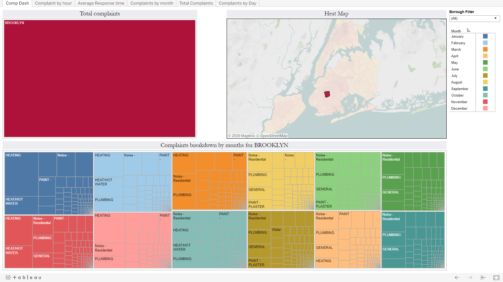
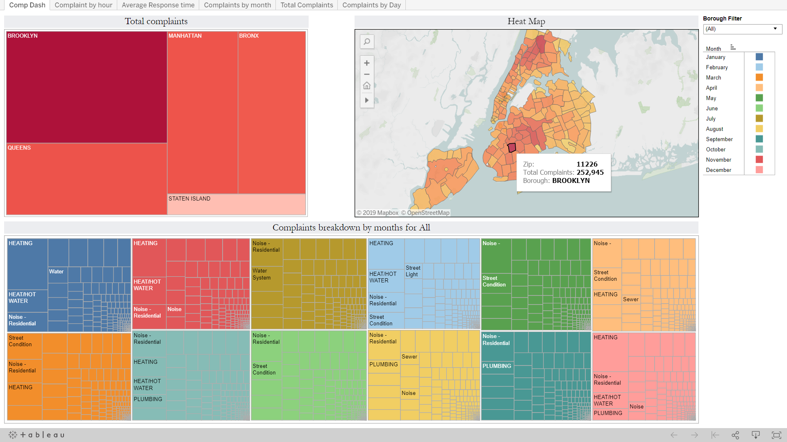
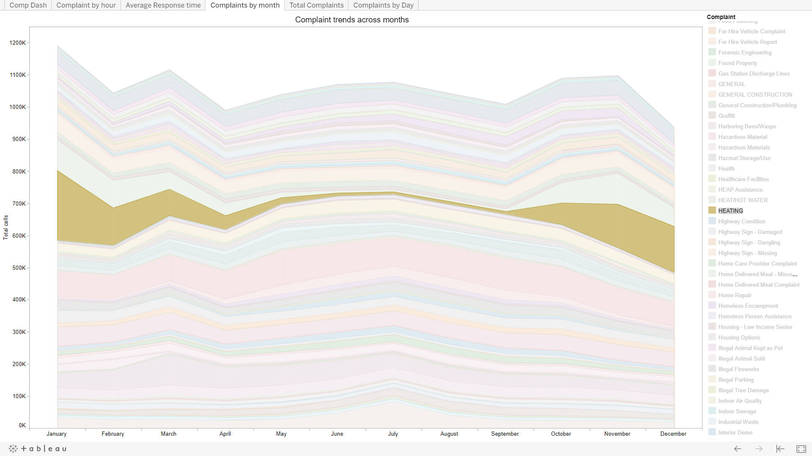
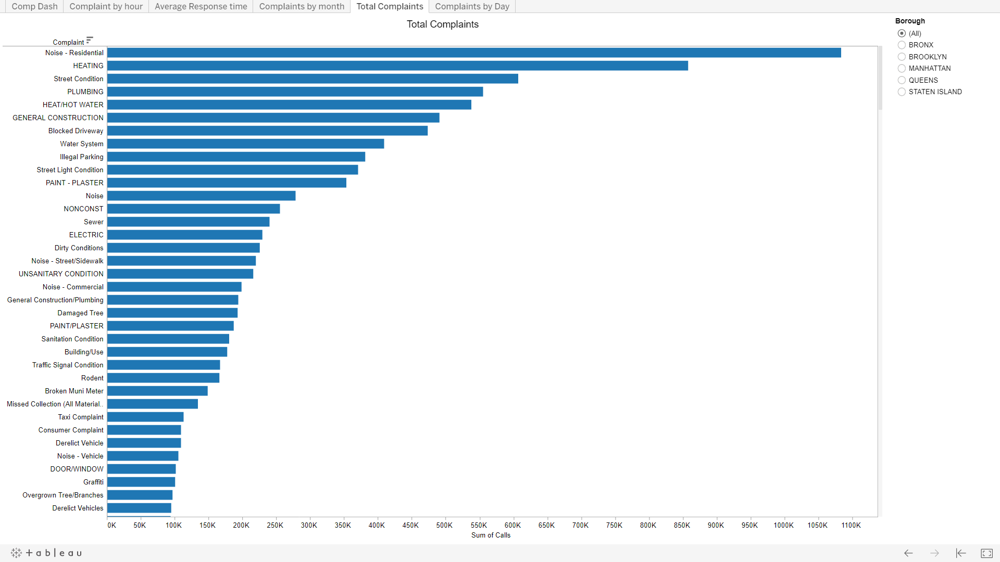
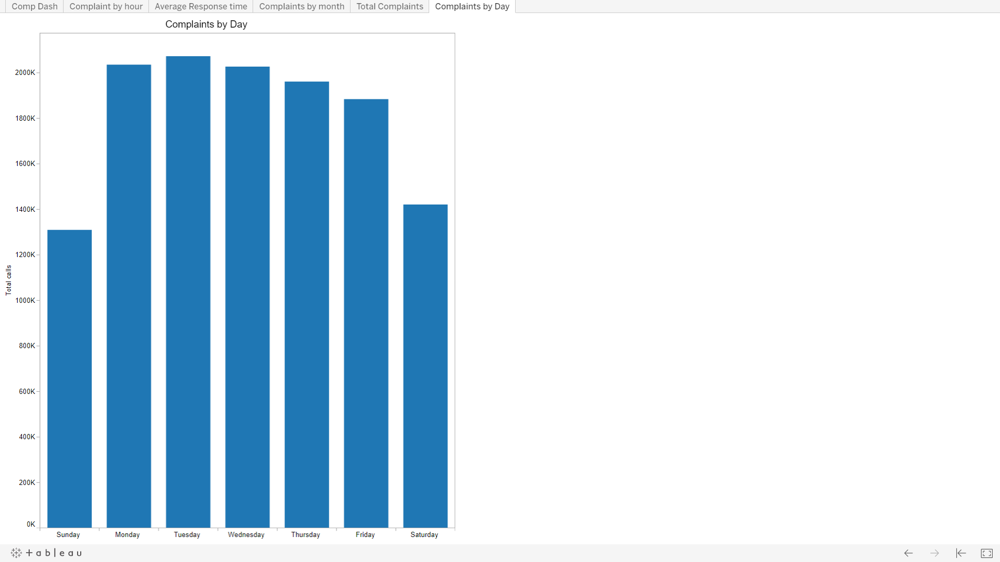

# 311 Service Requests data analysis
Data analysis of the NYC [311](https://nycopendata.socrata.com/Social-Services/311-Service-Requests-from-2010-to-Present/erm2-nwe9) Service Requests dataset.

Link to Tableau workbook :  [Tableau Workbook](https://vishalbharti1990.github.io/CSC-84030-Big-Data-management-Final-Project/)

### Filtering by Borough
{width=50%}

### Filtering by Month

### Filtering by Location

### Stats on Hover

### Service Requests by Hour of the day

### 'Snow' Service Request by Hour of the day

### New

### New

### New

### New

### New

